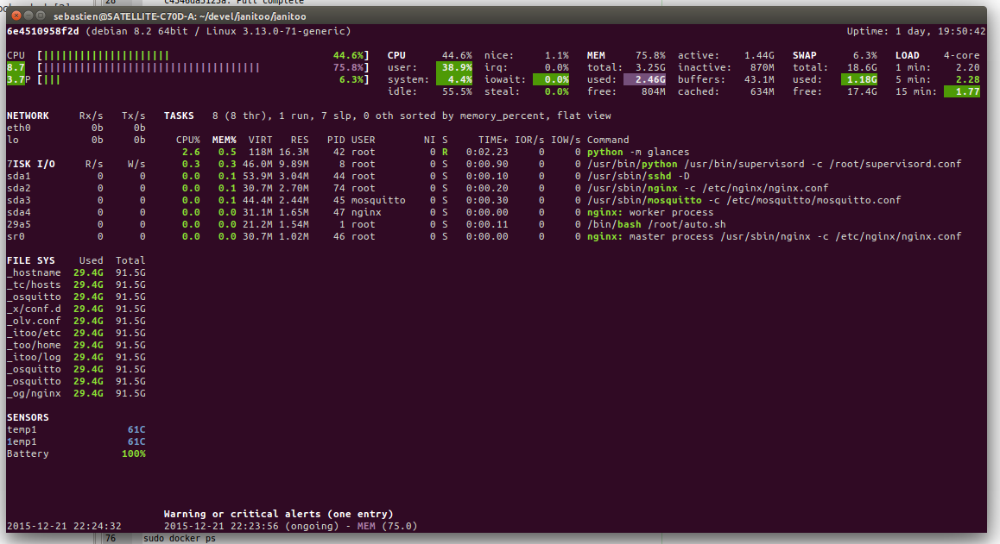

.. image:: https://img.shields.io/badge/Documenation-ok-brightgreen.svg?style=flat
   :target: https://bibi21000.github.io/janitoo_docker_hub/index.html
   :alt: Documentation

=============================
Welcome to janitoo_docker_hub
=============================

This is the bootstrap module for thoses that want to develop with the docker image.

It will install the last packages of docker using this method : https://docs.docker.com/engine/installation/ubuntulinux/ and https://docs.docker.com/engine/installation/debian/

Download
========
Docker needs to be root so it is launch with sudo. You can bypass the password ask updating your sudoers configuration. Or use :

.. code-block:: bash

    make sudoers

Update Makefile.local and pull an image. :

.. code-block:: bash

    make docker-pull

.. code-block:: bash

    latest: Pulling from bibi21000/janitoo_base
    fefe045f942e: Pull complete
    237b75df8e1d: Pull complete
    032cdf487b54: Pull complete
    f2efebaea0bf: Pull complete
    7436fc1e0756: Pull complete
    9991ed16bb41: Pull complete
    c4346da5125a: Pull complete
    318861f44983: Pull complete
    47daa6e89aae: Pull complete
    01d46dcf94d0: Pull complete
    8bd1dc8ee5f7: Pull complete
    3f7d2705207f: Pull complete
    b41e3a82b0a2: Pull complete
    df9233c9a589: Pull complete
    cbbf815735ca: Pull complete
    121866060cea: Pull complete
    ebb2c412c0b3: Pull complete
    8a2d494bd416: Pull complete
    37cc78a4532e: Pull complete
    cb2d7cc2ed1e: Pull complete
    a76292c89185: Pull complete
    5ccabf5e8651: Pull complete
    033daba93f37: Pull complete
    Digest: sha256:c20142fb990328c0b5c05dd4ae7ec90267be9b07d10e3eca1cfec2dc56a83406
    Status: Downloaded newer image for bibi21000/janitoo_base:latest

Check that image is here :

.. code-block:: bash

    make docker-images

.. code-block:: bash

    REPOSITORY               TAG                 IMAGE ID            CREATED             VIRTUAL SIZE
    bibi21000/janitoo_base   latest              033daba93f37        13 hours ago        993.6 MB
    bibi21000/janitoo        latest              2f541a72eded        11 days ago         885.7 MB
    <none>                   <none>              e7191bed9da0        11 days ago         921.6 MB

Change the default root password. It's important as your docker image will be available on your network. Enter the rescue mode (no network, no volume, only a bash) :

.. code-block:: bash

    make docker-rescue

In the new shell :

.. code-block:: bash

    root@28b4e9aff350:/opt/janitoo/src# passwd

.. code-block:: bash

    Enter new UNIX password:
    Retype new UNIX password:
    passwd: password updated successfully

You can launch it in foreground :

.. code-block:: bash

    make docker-live

After some seconds, you should have :

You can check that ssh, mosquitto, nginx are running. Press Ctrl + C to stop it.

You are ready to play with thr janitoo live demo. Please keep in minf that data will be lost on next update.

First installation
==================
At first, if you don't have a ssh key, generate one :

.. code-block:: bash

    make sshkey-generate

And publish it to janitoo :

.. code-block:: bash

    make sshkey-copy

Docker needs some disk space to store data, configurations (also known as volumes). The followin will create them under /opt/janitoo/docker :

.. code-block:: bash

    make docker-vols

We need to populate them with default configuration. Password will be asked many times, unless you're using ssh keys :

.. code-block:: bash

    make docker-conf

Come back to the first terminal and stop the docker rescue image using exit. Restart it in normal mode to check that your configuration is ok :

.. code-block:: bash

    make docker-run

You can check that ssh, mosquitto, nginx are running.

Start it
========
You are ready to start janitoo in the background :

.. code-block:: bash

    make docker-start

You can check its status using :

.. code-block:: bash

    make docker-ps

And stop it using :

.. code-block:: bash

    make docker-stop

By default, the janitoo's image listen on all interface on ports :

 - 8880 : reserved
 - 8881 : reserved
 - 8882 : ssh
 - 8883 : mqtt (mosquitto)
 - 8884 : reserved
 - 8885 : http (git)
 - 8886 : http (www)

Update it
=========
make sshkey-copy

/usr/bin/ssh-copy-id:
ERROR: @@@@@@@@@@@@@@@@@@@@@@@@@@@@@@@@@@@@@@@@@@@@@@@@@@@@@@@@@@@
ERROR: @    WARNING: REMOTE HOST IDENTIFICATION HAS CHANGED!     @
ERROR: @@@@@@@@@@@@@@@@@@@@@@@@@@@@@@@@@@@@@@@@@@@@@@@@@@@@@@@@@@@
ERROR: IT IS POSSIBLE THAT SOMEONE IS DOING SOMETHING NASTY!
ERROR: Someone could be eavesdropping on you right now (man-in-the-middle attack)!
ERROR: It is also possible that a host key has just been changed.
ERROR: The fingerprint for the ECDSA key sent by the remote host is
ERROR: dc:81:44:73:5e:97:69:77:1c:20:91:6d:4a:71:33:72.
ERROR: Please contact your system administrator.
ERROR: Add correct host key in /home/xxxxxxxxxxxxxxxx/.ssh/known_hosts to get rid of this message.
ERROR: Offending ECDSA key in /home/xxxxxxxxxxxxxxxx/.ssh/known_hosts:336
ERROR:   remove with: ssh-keygen -f "/home/xxxxxxxxxxxxxxxxxxxx/.ssh/known_hosts" -R [127.0.0.1]:8882
ERROR: ECDSA host key for [127.0.0.1]:8882 has changed and you have requested strict checking.
ERROR: Host key verification failed.

Make a copy paste :

ssh-keygen -f "/home/xxxxxxxxxxx/.ssh/known_hosts" -R [127.0.0.1]:8882

Documentation
=============
You can browse online documentation here : https://bibi21000.github.io/janitoo_docker_hub/.
